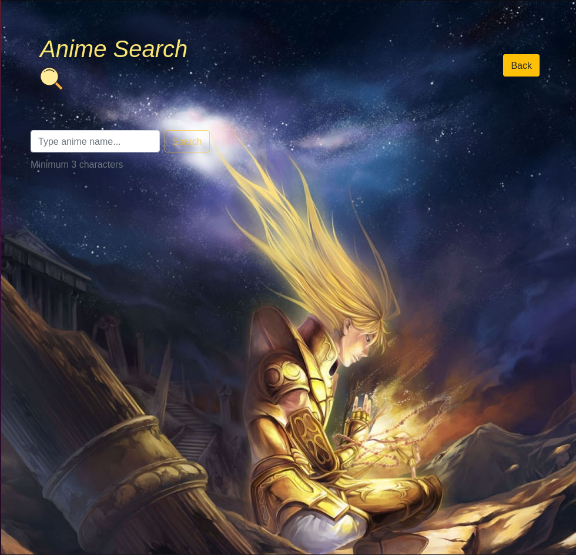
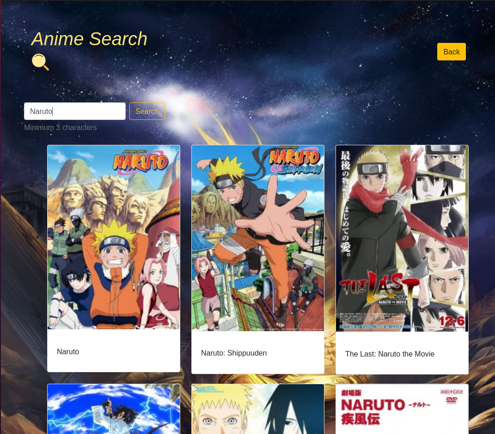
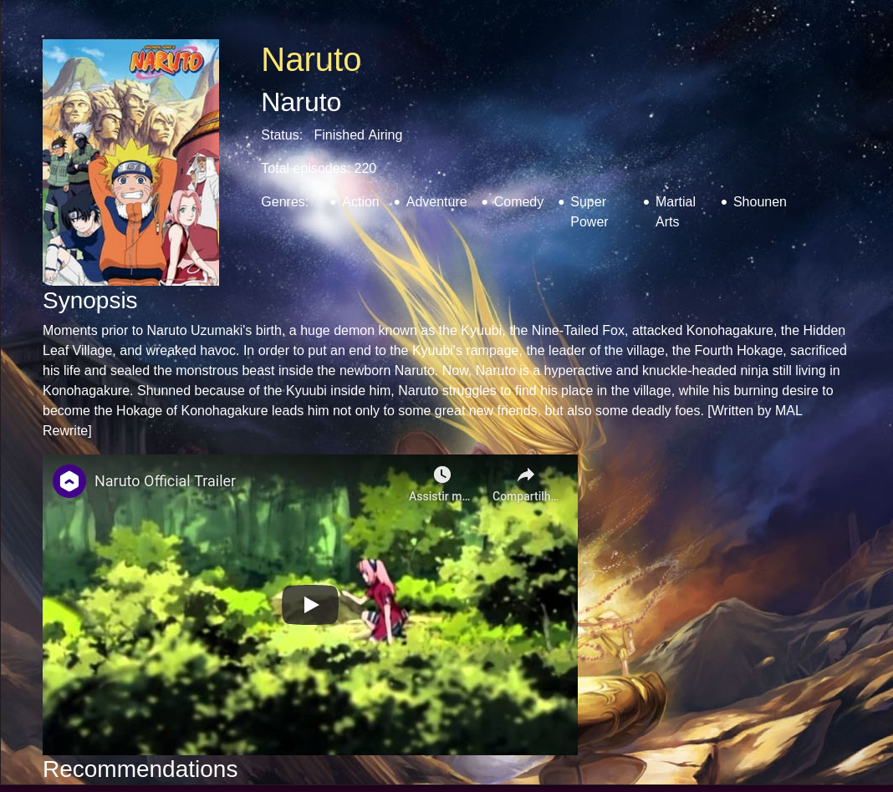
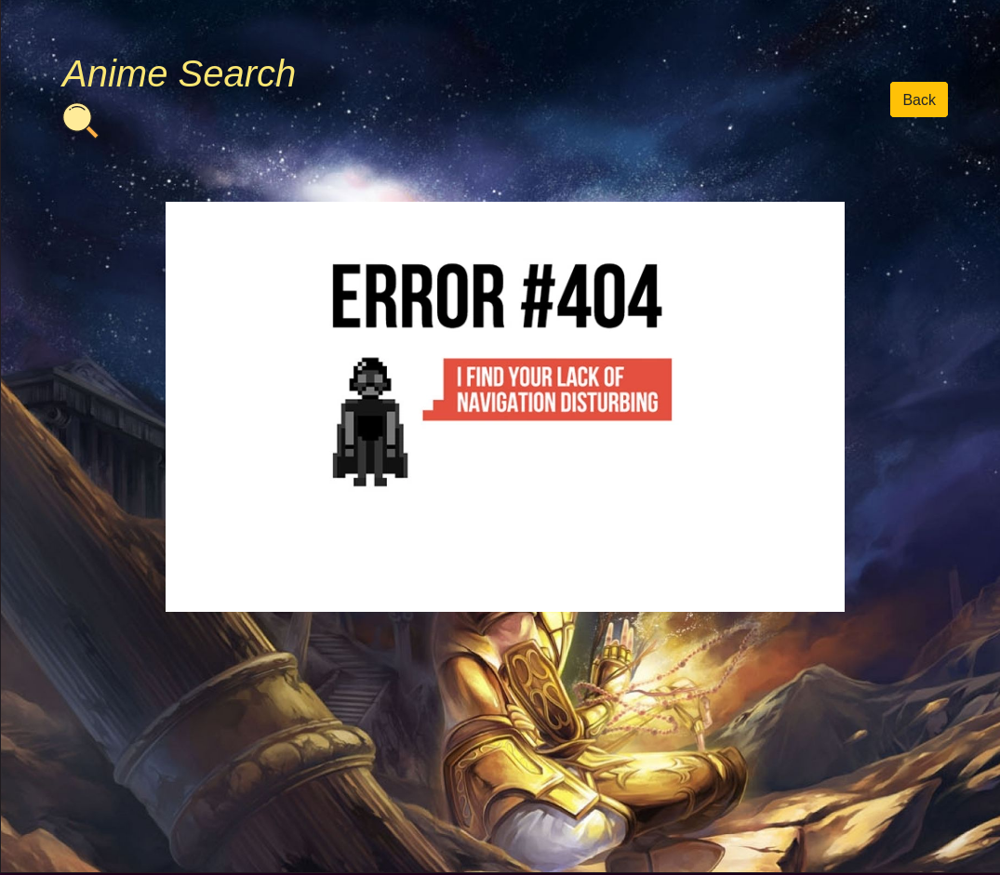

# [ anime-search ]

## *Project developed using JavaScript, React Hooks, Jikan API and Bootstrap to help with css :-)*

---

### *Initial Page*

### *Search Result*

### *Details Page*

### *NotFound Page*

---

## 📚 Bibliotecas utilizadas

- [Create React App](https://reactjs.org/docs/create-a-new-react-app.html)
- [React Router Dom](https://www.npmjs.com/package/react-router-dom)
- [React Player](https://github.com/CookPete/react-player)
- [Axios](https://www.npmjs.com/package/axios)
- [Bootstrap](https://getbootstrap.com/)

## 🔗 Links

- [Jikan public API](https://jikan.moe/)
- [JSX - React Docs](https://reactjs.org/docs/introducing-jsx.html)
- [Hooks - React Docs](https://reactjs.org/docs/hooks-intro.html)

## 🚀 LinkedInd

- [Junio Melo](https://www.linkedin.com/in/juniomelos/)
